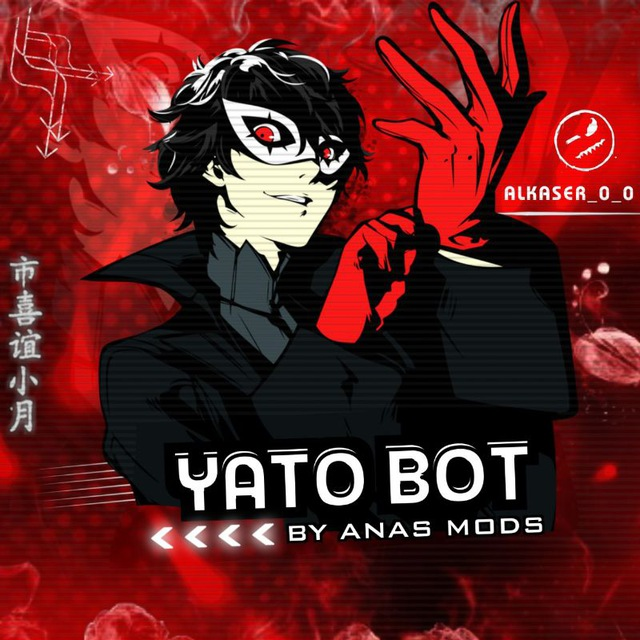

<p align="center">
    
</p>
<h1 align="center">RyzumiMD-ESM</h1>

</p>
<p align="center">
<a href="https://github.com/ShirokamiRyzen"></a>

##
[](https://api.whatsapp.com/send/?phone=6285864034767&text=.menu)
[](https://whatsapp.com/channel/0029Vb2qO9Q5vKAGd2t7ap1F)
[](https://wa.me/6285174269046)
 

# IMPORTANT!!!
## All visual assets (images, icons, sprites, characters, UI elements) in this repository are © Ryzumi Network. You may not reuse, redistribute, or modify these assets without explicit permission.
### The code remains licensed under GNU GPL v3.

## NOTE BEFORE USING!!
- Edit all Owner Information on config.example.js
- Dont forget to rename `config.example.js` to `config.js`
- If the pairing code not appear in your terminal, simply go to `/sessions/creds.json` and you will see the code


### a little about this bot
- ✔️ | **Simple** 
- ✔️ | **No Button** 
- ✔️ | **Multi Device** 
- ✔️ | **Plugins** 
- ✔️ | **ESM Style Code** 
---------
### Some of the features include
- ✔️ | Memfess
- ✔️ | AntiCall
- ✔️ | Welcome & Leave
- ✔️ | AI Feature
- ✔️ | Sticker 
- ✔️ | Downloader 
- ✔️ | Anime
- ✔️ | Tools 
---------

## Requirements

* NodeJS V20+
* FFMPEG
* Imagemagick
* NodeJS basic knowledges (dont be an idiot)

#### Setup bot on your Machine
```bash
$ git clone https://github.com/ShirokamiRyzen/RyzumiMD-ESM
$ cd RyzumiMD-ESM
$ npm i
```

---------

## Run

```bash
npm start
```

---------

#
### Terms
1. Dont sell this script!
2. Dont forget to star this repository!
3. Follow my GitHub!
4. Use with your own risk!

---------

### Thanks To
[](https://github.com/Nurutomo)
[](https://github.com/WhiskeySockets/Baileys)
[](https://github.com/BochilGaming)
[](https://github.com/ImYanXiao)
[](https://github.com/Xnuvers007)
[](https://github.com/ShirokamiRyzen)
#### Contributor
[](https://github.com/ShirokamiRyzen)
[](https://github.com/AgusXzz)
[](https://github.com/MythEclipse)

---------
